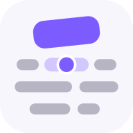
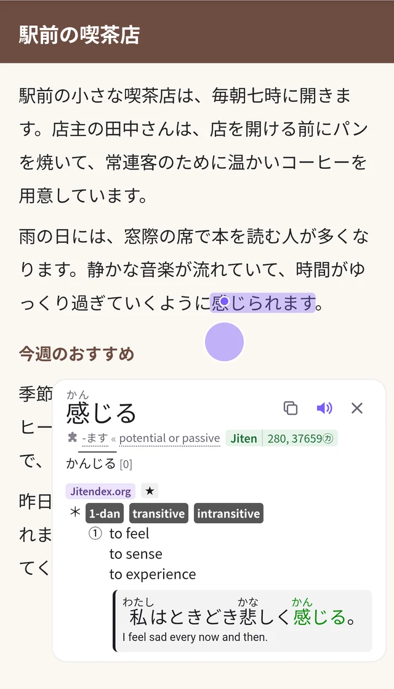
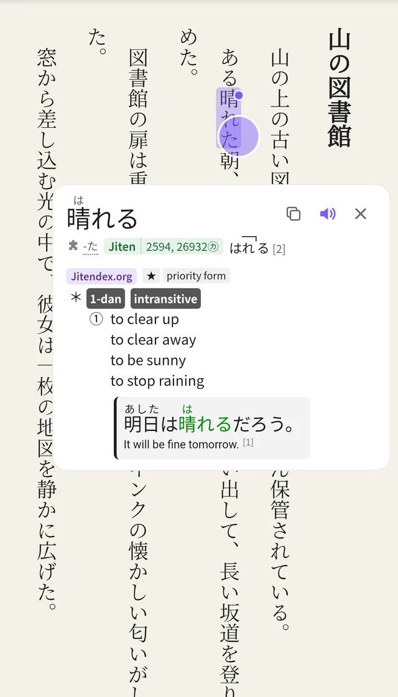
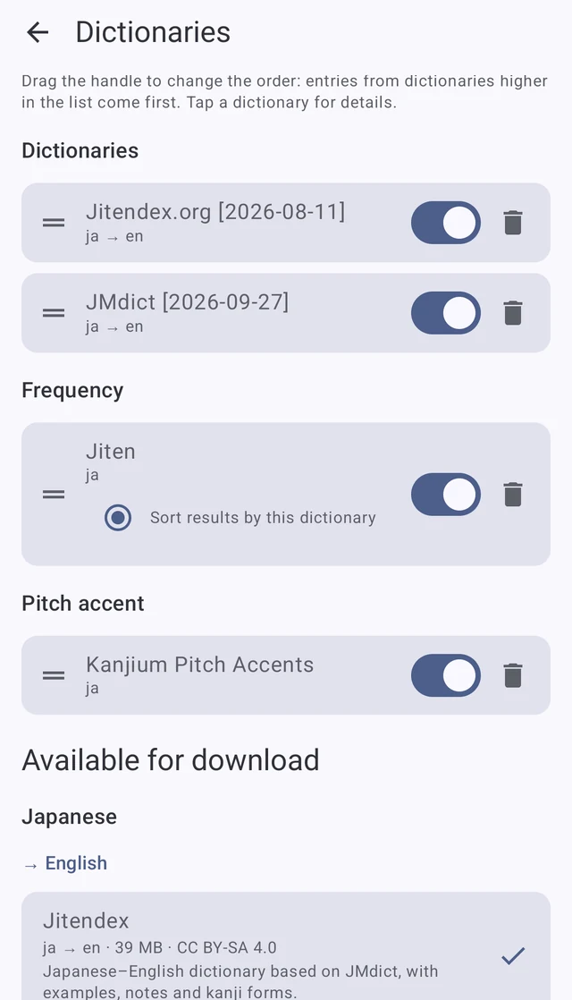
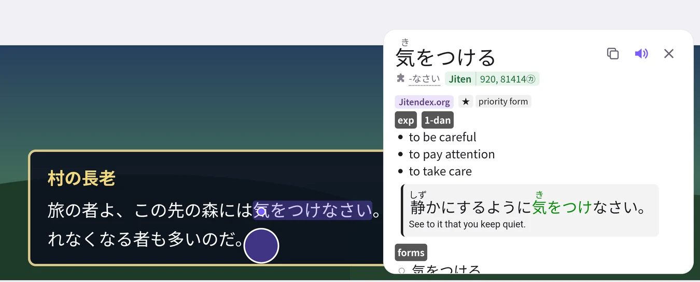

# Screenlate



A pop-up Japanese dictionary for Android that works over any app. Pull the bubble out from the edge of the screen, point it at a word, and the dictionary entry appears next to it: in a browser, a game, a manga reader or a video on pause.

<p>
  
  
  
</p>
<p>
  
</p>

<sub>Screenshots: entries from Jitendex (CC BY-SA 4.0), frequencies from Jiten, pitch accents from Kanjium; the texts were written for these screenshots.</sub>

## Features

- **Any app, any orientation.** Horizontal and vertical text, portrait and landscape. The popup opens where there is room and never covers the word.
- **Text from the screen.** Cloud recognition with an instant on-device draft, or the app's own text where the app exposes it (exact and offline), or only the app's text, without recognition, for e-ink readers and weak devices.
- **Yomitan dictionaries**, looked up and shown the way Yomitan does it: rich entries with examples and images, frequencies, pitch accent, inflections with explanations, kanji entries.
- **Dictionaries included**: JMdict (English), a frequency list and pitch accents work right after installing. Jitendex, dictionaries for other languages, kanji and name dictionaries are one tap away in the built-in catalog; any Yomitan `.zip` or a whole Yomitan dictionary collection can be imported.
- **Anki cards** through AnkiDroid: your deck, note type and field templates (Yomitan's markers), duplicate checks, pronunciation audio and a cropped screenshot of the scene.
- **Pronunciation** from the same audio sources as Yomitan, or the phone's text-to-speech.
- **Search** screen and "Look up in Screenlate" in the text selection menu of other apps.
- **Import from Yomitan**: dictionary order, Anki setup, audio sources, lookup and popup settings.
- **Your look**: popup font and text size, custom CSS, light and dark theme, an e-ink mode; the interface is in English and Russian.
- **Backup and restore** of all settings and, if you like, the dictionaries, in one file.
- **Updates** from GitHub Releases inside the app.

Only Japanese is supported for now.

## Install

1. Download an APK from [Releases](https://github.com/v1p3rrr/screenlate/releases/latest): `arm64-v8a` fits most phones, `armeabi-v7a` older 32-bit ones, `x86_64` emulators; the `universal` APK runs everywhere but is larger. Obtainium can track the releases too.
2. Open Screenlate and enable its accessibility service; the start screen links to the setting. The service draws the bubble and reads the screen when you scan.
3. If the switch is greyed out after installing from a file: App info → ⋮ → Allow restricted settings.
4. On phones with aggressive battery management, let Screenlate run in the background, or the system may stop the service.

[docs/usage.md](docs/usage.md) explains the gestures and every setting.

## Requirements

- Android 11 or newer.
- AnkiDroid, for Anki cards.
- A network connection for cloud recognition, audio and dictionary downloads. Lookups, the on-device draft and the app's own text work offline.

## Limitations

- Japanese only.
- Cloud recognition uses an unofficial service that may change or stop working at any time; the app then falls back to on-device recognition, which is less accurate on small or stylized text.
- Screens that block screenshots (some banking apps, protected video) cannot be scanned. "Read app text" and "App text only" can still read apps that expose their text.
- The bubble lives in an accessibility service; some phones stop such services in the background (see Install).
- Developed and tested on a small number of devices.

## Privacy

- No accounts, ads or analytics.
- With cloud recognition, a scaled-down screenshot of the app under the bubble is sent for recognition when you scan: when the bubble is pulled out or tapped. The on-device draft and the app's own text stay on the phone.
- Audio sources receive the word being played. Dictionary downloads and update checks contact the dictionary hosts and GitHub.
- The accessibility service reads the screen only when you scan. It also notices which app is in front, to hide the bubble in the apps you choose.
- The app's log never contains recognized text or looked-up words, and leaves the phone only when you share it.

## License

Screenlate is free software under the GPL-3.0 ([LICENSE](LICENSE)). [NOTICE](NOTICE) lists the third-party code and data with their licenses; the app shows the same under About.

The bundled dictionaries keep their own licenses: JMdict by the Electronic Dictionary Research and Development Group, the Jiten frequency list and the Kanjium pitch accents, all under CC BY-SA 4.0. Dictionaries from the catalog are downloaded from their authors' releases and show their license before downloading; dictionaries you import yourself are yours to license.

Screenlate is an independent project, not affiliated with the dictionary authors, Anki, AnkiDroid, Yomitan or the cloud recognition provider.

## Building from source

```
git submodule update --init --recursive
./gradlew assembleDebug
```

Needs JDK 17+, the Android SDK with platform 37, NDK 29.0.14206865 and CMake 3.31.6. [docs/development.md](docs/development.md) covers tests, releases and signing; [docs/architecture.md](docs/architecture.md) the internals.
